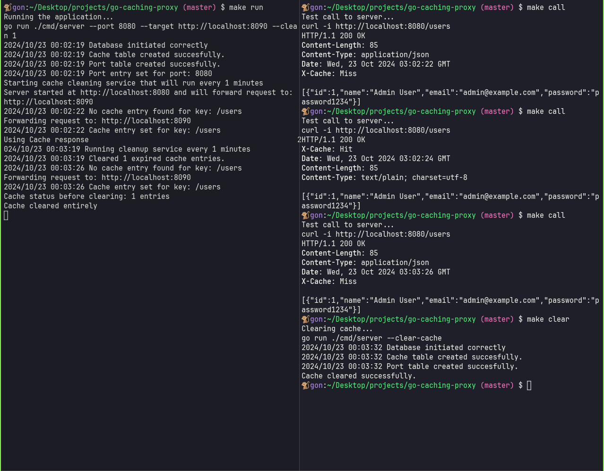

# Golang Caching Proxy Server

<div style="display: flex; align-items: center; justify-content: center;">
    
</div>

This project is a CLI tool written in pure Go, without external libraries, that starts a caching proxy server. The server forwards requests to a target server and caches the responses. If the same request is made again, the cached response is returned instead of forwarding the request to the target server.

The tool provides two ways to clear the cache:

1. **Interval Service**: Clears the cache automatically at specified intervals.
2. **On-Demand Clearing**: Allows users to clear the cache via CLI while the server is running, without needing to restart it.

## Features

- **Caching Proxy**: Forwards requests to the target server and caches the responses.
- **Cache Hit/Miss Indicators**: Responses include headers to indicate whether the response was served from the cache (`X-Cache: HIT`) or fetched from the target (`X-Cache: MISS`).
- **Cache Cleanup Service**: Option to clean cache entries at specified intervals.
- **Clear Cache Command**: CLI command allows clearing the cache manually without restarting the proxy server.

## Requirements

- Golang installed (version >= 1.15)

## Installation

Clone the repository and build the CLI tool:

```bash
git clone https://github.com/GonzaloGorgojo/go-caching-proxy.git
cd go-caching-proxy
```

Example usage:

```bash
go run ./cmd/server --port 8080 --target http://dummyjson.com
```

This command starts the proxy server on localhost:8080, which forwards all requests to http://dummyjson.com. When a client makes requests to http://localhost:8080, the proxy forwards them to http://dummyjson.com and caches the responses for future requests.

To clear the cache without stopping the server:

```bash
go run ./cmd/server --clear-cache
```

Finally, you can start the server with a cache cleanup service that runs at specified intervals. For example, to automatically clean the cache every 5 minutes:

```bash
go run ./cmd/server --port 8080 --target http://dummyjson.com --clean 5
```

In this case, the server runs as usual but also cleans expired cache entries every 5 minutes.

### Next:

- Persistent Caching with SQLite: I plan to add SQLite support to persist cache data on disk. This will allow the cache to be retained even after restarting the proxy server, providing more robust caching in environments where frequent restarts are common.

## Note

This project serves as a solution to the [Roadmap.sh Caching Server Problem](https://roadmap.sh/projects/caching-server). The code can be easily modified or extended to add more advanced caching mechanisms, persistent storage, or additional features.
